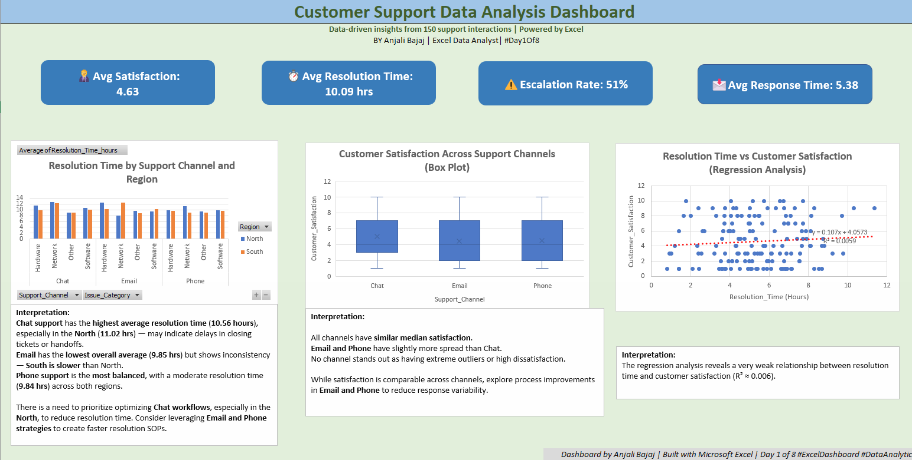

# excel-customer-dashboard
Customer Satisfaction Dashboard built using Excel - Part of 8-Day Data Analysis Journey
# 📊 Customer Satisfaction Dashboard – Excel Project

🚀 Part of my 8-Day Data Analysis Journey — Day 1: Excel

This project analyzes customer satisfaction data across different regions, issue categories, and support channels using:

- ✅ Descriptive Statistics
- 📦 Box Plots
- 🔍 t-Test, ANOVA, Chi-Square
- 📈 Regression & Correlation
- 🎯 KPI Cards & Visual Dashboard

🛠 Tools Used: Excel (Advanced functions, PivotTables, Charts, Conditional Formatting)

---

## 📸 Sneak Peek of the Dashboard

---

## 📁 Files Included:
- `Dashboard.png`: Final Excel dashboard (for preview)
- `Dashboard.xlsx`: Interactive file with all calculations, charts & analysis
- `Dashboard.pdf`: Printable version
- `README.md`: This file

---

## 🧠 Why This Matters

In a world where CX defines business success, data is the bridge between feedback and action. This Excel dashboard demonstrates how raw data becomes strategic insight.

---

## 📌 About Me

Hi! I’m Anjali – passionate about data, storytelling, and working with unconventional companies. Follow along as I decode real-world businesses one dataset at a time.

---

## 🔗 Let’s Connect
Feel free to [connect on LinkedIn] www.linkedin.com/in/anjali-bajaj-1941data and let me know what you think!
